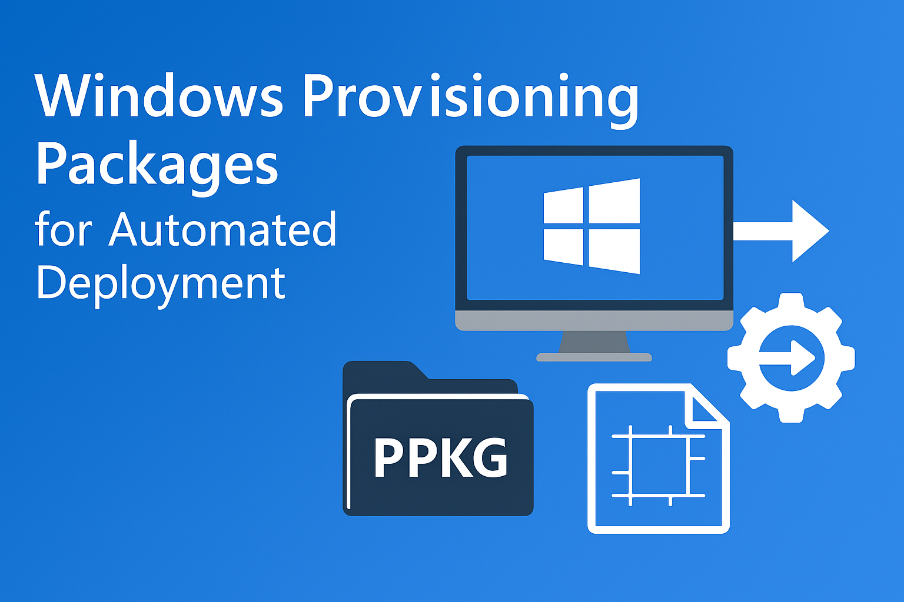

# PPKG
Provisioning Packages for Windows Automation — Ready-to-use PPKG files and editable project templates to help IT professionals quickly automate Windows deployment and learn PPKG creation.

# Windows Provisioning Packages (PPKG) for Automated Deployment

## 📌 Overview
This repository provides **Windows Provisioning Packages (PPKG)** and **project files** to help IT professionals and tech enthusiasts:
- Automate Windows deployment efficiently
- Reduce manual setup time and repetitive tasks
- Learn how to create and customize PPKGs using **Windows Configuration Designer**

---

## 📂 Repository Structure
- **`/packages/`**  
  Pre-built `.ppkg` files ready to apply directly on Windows systems.
  
- **`/projects/`**  
  Windows Configuration Designer project files (`.proj`, etc.) for learning and customization.

---

## 🚀 How to Use

### 1. **Apply PPKG Directly**
1. Download the `.ppkg` file from the `/packages/` folder.
2. Double-click the `.ppkg` on the target Windows device.
3. Follow the prompts to complete configuration.

### 2. **Edit and Customize**
1. Install **Windows Configuration Designer**.
2. Open the project file from the `/projects/` folder.
3. Modify the settings as needed.
4. Build a new `.ppkg` file and deploy it.

---

## 🛠 Use Cases
- Enterprise-scale Windows deployment
- Education and training
- Rapid setup for test and lab environments
- Personal customized system initialization

---

## 📧 Contact
For questions or collaboration requests, please use the GitHub Issues section.
